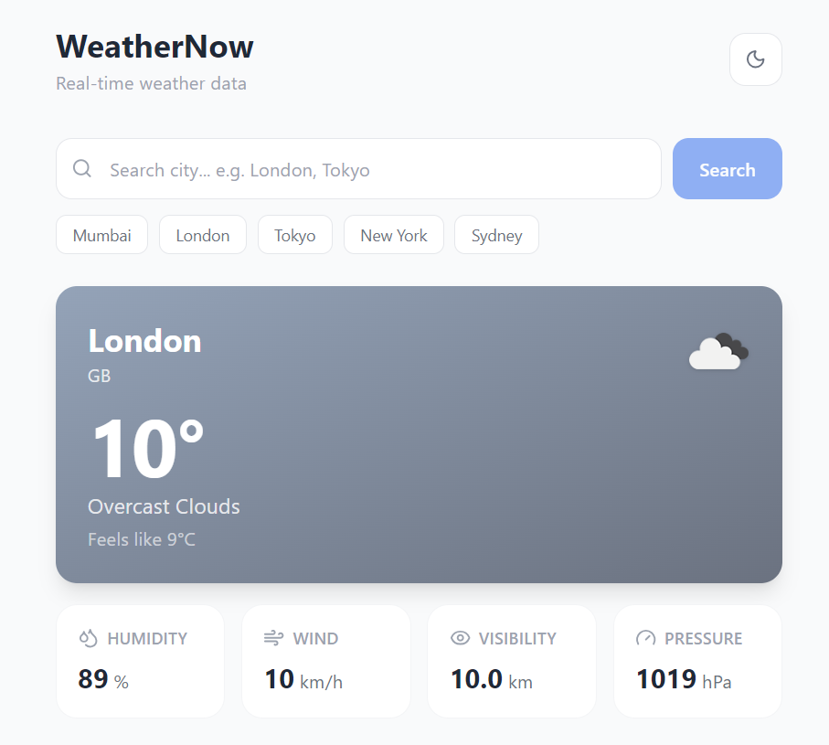
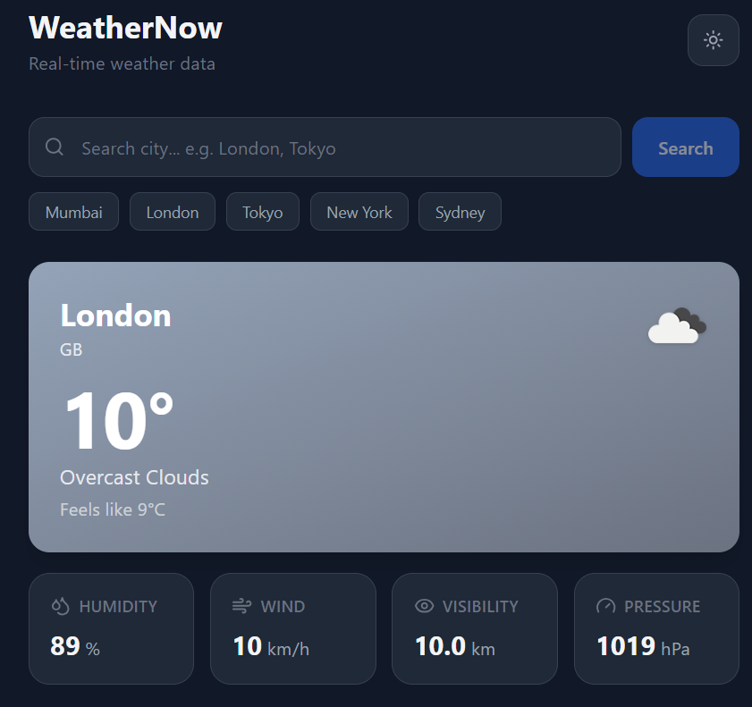

# WeatherNow 🌤

A real-time weather app built with React.js and Tailwind CSS. Search any city in the world and instantly see temperature, humidity, wind speed, visibility, and pressure — with full dark mode support.

**Live Demo:** [Add your Vercel link here]

---

## Screenshots

| Light Mode | Dark Mode |
|---|---|
|  |  |

---

## Features

- 🔍 Search any city worldwide
- 🌡 Displays temperature, feels like, humidity, wind speed, visibility, pressure
- ⏳ Loading skeleton while data is fetching
- ❌ Error handling for invalid cities and network failures
- 🌙 Dark / Light mode toggle with localStorage persistence
- ⚡ Quick city buttons for fast access

---

## Tech Stack

| Technology | Purpose |
|---|---|
| React.js | UI and state management |
| Tailwind CSS | Styling |
| Vite | Build tool and dev server |
| OpenWeatherMap API | Live weather data |
| Fetch API | HTTP requests |
| localStorage | Persist dark mode preference |

---

## Project Structure

```
src/
├── hooks/
│   └── useWeather.js       # Custom hook — API call, loading, error states
├── components/
│   ├── SearchBar.jsx        # Controlled search input
│   ├── WeatherCard.jsx      # Displays weather data
│   ├── LoadingSkeleton.jsx  # Skeleton UI while fetching
│   └── ErrorMessage.jsx     # Error display component
├── App.jsx                  # Root component, dark mode toggle
├── main.jsx                 # React entry point
└── index.css                # Tailwind base styles
```

---

## Getting Started

### 1. Clone the repository

```bash
git clone https://github.com/YOUR_USERNAME/weather-app.git
cd weather-app
```

### 2. Install dependencies

```bash
npm install
```

### 3. Run the development server

```bash
npm run dev
```

Open [http://localhost:5173](http://localhost:5173) in your browser.

### 4. Build for production

```bash
npm run build
```

---

## API Used

This app uses the **OpenWeatherMap Current Weather API** (free tier).

- Base URL: `https://api.openweathermap.org/data/2.5/weather`
- Docs: [https://openweathermap.org/current](https://openweathermap.org/current)
- The API key included is a public demo key. For production use, [get your own free key](https://home.openweathermap.org/users/sign_up).

---

## Key Concepts Used

**Custom Hook (`useWeather`)**
All API logic is extracted into a custom hook. It manages three states every real API call needs — `loading`, `error`, and `data`.

```js
const { weather, loading, error, fetchWeather } = useWeather();
```

**Async/Await with error handling**
```js
try {
  const response = await fetch(url);
  if (!response.ok) throw new Error("City not found");
  const data = await response.json();
} catch (err) {
  setError(err.message);
} finally {
  setLoading(false); // always stops loading
}
```

**Dark mode with localStorage**
```js
const [dark, setDark] = useState(
  () => localStorage.getItem("theme") === "dark"
);
```

---

## What I Learned

- How to call a REST API using `fetch` and `async/await`
- How to handle loading, success, and error states in React
- How to build a custom hook to separate logic from UI
- How to implement dark mode using Tailwind's `dark:` classes
- How to use `localStorage` for persistent user preferences

---

## Author

**Your Name**
- GitHub: [@your_username](https://github.com/your_username)
- LinkedIn: [linkedin.com/in/your_profile](https://linkedin.com/in/your_profile)

---
